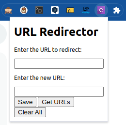

# url-redirector

**URL Redirector** is a chrome extension to enable URL redirection. 

It allows to create redirects for specific page.

## Example

- twitter.com to redirect always to your twitter list

- github.com to redirect always to your organisation

